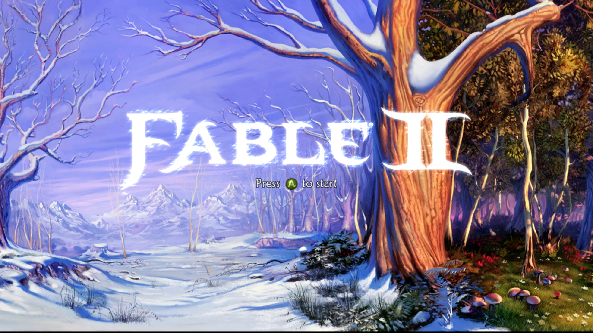

# Fable II Recomp

**Fable2Recomp** is an attempt to bring **Fable II** to PC through static recompilation using [ReXGlue](https://github.com/rexglue/rexglue-sdk).

The project currently targets **Fable II: Game of the Year Edition, TU1**.

The priority for now is simple: get the original game running correctly. Improvements such as higher resolutions, higher frame rates and other PC-specific features can come later once the game is stable.

## Current Status

The recompiled executable now reaches the **Fable II title screen**.



The game is **not yet considered playable**. Work is ongoing to identify and fix recompilation and runtime issues as they appear.

The current static function-discovery architecture and verified TU1 evidence
are documented in
[`docs/fable2-discovery-pipeline/01-static-entrypoint-closure.md`](docs/fable2-discovery-pipeline/01-static-entrypoint-closure.md).

## Goals

* Recompile Fable II into a native executable.
* Match the behaviour of the original Xbox 360 release as closely as possible.
* Get the game fully playable on Windows.
* Support Linux where practical.
* Use ReXGlue for Xbox 360 runtime functionality rather than reimplementing existing functionality unnecessarily.
* Investigate higher resolutions and frame rates once the original game is stable.

## Building Fable2Recomp

### ReXGlue SDK

Download the latest [ReXGlue SDK release](https://github.com/rexglue/rexglue-sdk/releases) and extract it somewhere convenient.

Set the extracted SDK location as your `REXSDK` environment variable.

### Building ReXGlue from source

If you want to build ReXGlue yourself:

```bash
git clone --recursive https://github.com/rexglue/rexglue-sdk
cd rexglue-sdk

cmake --preset <platform>
cmake --build out/build/<platform> --target install
```

Where `<platform>` is currently:

```text
win-amd64
linux-amd64
```

### Building Fable2Recomp

Clone the repository:

```bash
git clone --recursive https://github.com/FenrisSkoll/Fable2Recomp.git
cd Fable2Recomp
```

Place the required Fable II game files in the appropriate `assets` directories.

Generate the recompiled source:

```bash
rexglue codegen fable2_manifest.toml
```

Configure and build:

```bash
cmake --preset <platform>
cmake --build out/build/<platform>
```

For example on Windows:

```bash
rexglue codegen fable2_manifest.toml
cmake --preset win-amd64
cmake --build out/build/win-amd64
```
