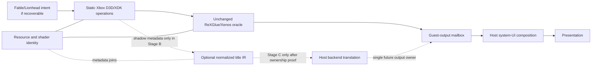

# Custom renderer reference architecture

## Status

This is a planning hypothesis, not implementation authorization. Initial evidence work leaves ReXGlue rendering unchanged and keeps `rexgpu-xenos.dll` as the sole GPU owner and behavioral oracle.

The architecture is valid only if it avoids duplicate ring consumption, register/resource ownership, command submission, guest-output production and presentation. The pinned corpus does not yet prove an incremental native/oracle output transition.

## Reference flow

The solid path is current compatibility behavior. Dotted paths are hypotheses and must not operate as a second renderer.

## Components

### `ARC-FABLE-INTENT` — Fable/Lionhead intent, if recoverable

- Inputs: Lionhead renderer objects, queues, method calls and title-owned state recovered from exact TU1.
- Outputs: operation identity and stable title object/resource references.
- Owned state/lifetime: none during observation; future ownership depends on proved object lifetime.
- Thread/ordering: must preserve guest caller and any producer/consumer queue order.
- Fable dependency: total.
- ReXGlue dependency: original methods continue into ReXGlue until replacement coverage and ownership are proved.
- Fallback: execute the preserved original body exactly once.
- Evidence: `sub_82AAC208` is a strong queue-processing hypothesis; renderer labels exist.
- Unvalidated assumption: a stable, sufficiently complete Lionhead command ABI exists.

### `ARC-STATIC-XDK` — static Xbox D3D/XDK operations

- Inputs: guest device/resource/state/shader/draw/resolve/query method arguments.
- Outputs: backend-neutral operation descriptions or unchanged original Xbox graphics calls.
- Owned state/lifetime: guest objects remain title-owned; observation owns no mutable copy.
- Thread/ordering: exact guest call order, return values, callbacks and synchronization.
- Fable dependency: exact TU1 implementation and ABI.
- ReXGlue dependency: original path uses Vd/ring/runtime services.
- Fallback: unknown or unqualified methods always forward to the original.
- Evidence: G1 confirmed device/ring/interrupt/swap/shutdown methods, including `sub_82BA34D8`.
- Unvalidated assumption: representative draw/resource/shader/target methods can be recovered and provide adequate coverage. This is `EXP-STATIC-XDK-001`.

### `ARC-TITLE-IR` — optional normalized title-specific IR

- Inputs: only stable operations proved at `ARC-FABLE-INTENT` or `ARC-STATIC-XDK`.
- Outputs: ordered backend-neutral resource, state, shader, draw, resolve, query and present operations.
- Owned state/lifetime: immutable operation records and explicit resource identities; never an independent guest register or memory owner.
- Thread/ordering: preserves source sequence, submission dependencies, queries and synchronization.
- Fable dependency: schema is deliberately title-specific, not a general Xenos ABI.
- ReXGlue dependency: may reference ReXGlue-owned oracle identities during observation; no mutation.
- Fallback: absence of an IR operation means original forwarding, not guessing.
- Evidence: the source corpus separates guest semantics from D3D12 capability branches.
- Unvalidated assumption: an extra IR is useful; method recovery may show direct translation is simpler.

### `ARC-XENOS-ORACLE` — ReXGlue behavioral oracle and correlation

- Inputs: unchanged TU1 Vd/ring/PM4 stream and guest memory.
- Outputs: current guest-visible GPU behavior, low-level metadata only if later authorized, and guest output.
- Owned state/lifetime: sole current `IGraphicsSystem`, ring, register, memory visibility, interrupt, vblank, query, cache, submission and graphics shutdown state.
- Thread/ordering: ReXGlue GPU Commands/VSync threads, pipeline workers and GPU queues.
- Fable dependency: none in general implementation; exact Fable stream/config selects executed behavior.
- ReXGlue dependency: intrinsic.
- Fallback: this is the compatibility fallback and remains unchanged.
- Evidence: exact DLL identity, Run 047/048 initialization, and the G1.5A/C source corpus.
- Unvalidated assumption: a future integration can retain selected services while replacing rendering. No such interface is proved.

### `ARC-RESOURCE-IDENTITY` — privacy-preserving resource and shader identity

- Inputs: guest addresses/ranges already used by the renderer, shader type/length, pipeline/binding/pass identities and generations.
- Outputs: hashes, IDs, format/layout metadata and join keys.
- Owned state/lifetime: bounded per-run maps only; no guest resource payload or independent validity state.
- Thread/ordering: records inherit producer sequence and submission/draw IDs.
- Fable dependency: joins affected Fable draws/resources; no asset-name assumption.
- ReXGlue dependency: reads identities from current owner without new guest memory reads.
- Fallback: failed identity recording drops metadata and leaves rendering unchanged.
- Evidence: `IssueDraw`, shader, texture, RT and SharedMemory surfaces expose the necessary fields.
- Unvalidated assumption: hashes and bounded metadata are sufficient to identify the black-surface path at L4.

### `ARC-HOST-BACKEND` — host backend translation

- Inputs: qualified title operations or optional IR plus resource/shader identities.
- Outputs: one host API command stream and guest-output image.
- Owned state/lifetime: one backend's pipelines, descriptors, resources, queues and fences.
- Thread/ordering: preserves guest operation order, async readiness semantics, query lifetime and memory visibility.
- Fable dependency: supports the recovered Fable operation set first.
- ReXGlue dependency: unresolved for memory, interrupt, vblank, query and mailbox services.
- Fallback: no production fallback is proved while the oracle also owns output; Stage A remains active until a single-owner handoff exists.
- Evidence: G1.5C identifies backend-neutral semantics and D3D12 capability-dependent decisions.
- Unvalidated assumption: an ownership interface can feed the existing mailbox or replace the provider without implementing the full GPU ABI.

### `ARC-GUEST-MAILBOX` — guest-output mailbox

- Inputs: output from exactly one graphics owner.
- Outputs: synchronized guest image/reference and generation for the presenter.
- Owned state/lifetime: provider/presenter synchronization, output references and retirement.
- Thread/ordering: graphics producer to UI/presenter consumer; may coalesce frames.
- Fable dependency: none beyond output timing/size.
- ReXGlue dependency: current mailbox and `Presenter::RefreshGuestOutput`.
- Fallback: retain the current ReXGlue producer and mailbox.
- Evidence: pinned ReXGlue presentation source.
- Unvalidated assumption: a stable alternative producer interface exists.

### `ARC-HOST-UI` — host system-UI composition

- Inputs: guest output plus keyboard/achievement/overlay UIDrawers and input/focus state.
- Outputs: host-composited back buffer.
- Owned state/lifetime: UI thread, z-ordered drawers, dialog overlapped completion, achievement callback/toast queue and repaint state.
- Thread/ordering: after guest output, on the UI thread, before Present.
- Fable dependency: TU1 reaches keyboard and achievement routes; styling is not title correctness.
- ReXGlue dependency: ReXApp, XAM dialogs, AchievementManager, ImGuiDrawer and Presenter.
- Fallback: current ReXGlue UI and headless keyboard completion behavior.
- Evidence: exact static routes plus Run 047 keyboard/achievement execution.
- Unvalidated assumption: natural confirm/cancel, toast, resize and shutdown checkpoints all satisfy the contract.

### `ARC-PRESENTATION` — single presentation owner

- Inputs: guest-output/UI-composed back buffer, resize/present configuration and repaint requests.
- Outputs: DXGI Present result and retired swap-chain resources.
- Owned state/lifetime: one window/swap chain/back-buffer set and shutdown path.
- Thread/ordering: current D3D12 UI-thread paint path and configured guest/host scheduling.
- Fable dependency: none beyond pacing and output.
- ReXGlue dependency: current D3D12Presenter.
- Fallback: retain ReXGlue presentation.
- Evidence: `D3D12Presenter::PaintAndPresentImpl` and Run 047 output.
- Unvalidated assumption: whether future output can integrate without replacing the presenter.

## Semantic and capability separation

Guest-visible semantics belong above backend choices:

- topology, fetch formats/dimensions/swizzles and sampler/LOD;
- register reset/read/write ordering;
- shader operations and constants;
- EDRAM layout, resolve conversion and value model;
- query/report lifetime and guest memory visibility.

D3D12-only decisions remain below that layer:

- ROV/interlock path;
- descriptor/root-signature shape;
- async pipeline creation implementation;
- alpha-factor capability fallback;
- swap-chain/tearing behavior.

This keeps the exact RTX 5080 capability/configuration as an input, not as the definition of guest behavior.

## Ordering and fallback invariants

A qualified future path must preserve:

- packet/title-operation order and exact-once forwarding;
- one authoritative resource/register state;
- guest memory writes, invalidation and readback visibility;
- query/report completion and predication;
- interrupts, vblank and frame/mailbox behavior;
- guest output before host UI;
- UI focus, async result, persistence, z-order, resize and cancellation;
- one command-submission owner and one swap-chain owner.

An unimplemented operation must fall back before native side effects. If a result cannot be composed without both oracle and native rendering, the architecture falls back to all-oracle Stage A. It must not render both and compare visible output in production.

## Reference-project boundaries

- [UnleashedRecomp](../fable2-native-renderer/02-unleashed-recompiled-reference.md) is GPL architectural precedent only. Concepts may inform separation and lifecycle; source may not be copied into a differently licensed implementation without satisfying GPL obligations.
- [XenosRecomp](../fable2-native-renderer/04-architecture-options.md) is an optional MIT component/idea source that still requires exact Fable shader/operation qualification.
- [Plume](../fable2-native-renderer/04-architecture-options.md) is an optional MIT component/idea source that still requires Fable-specific capability, correctness and integration qualification.

“Adapt concept, not source” applies wherever license, title assumptions or integration shape do not match. Reference age, another title's success and visual similarity are not Fable reachability evidence.

## Architecture gate

The smallest supported hypothesis is:

1. keep ReXGlue unchanged as oracle;
2. recover representative static XDK methods;
3. prove exact forwarding only where needed;
4. attach minimal low-level metadata only after a decision requires it;
5. identify one affected L4 path;
6. prove a single-owner integration model;
7. only then consider a title backend or optional IR.

The ownership transition at step 6 is currently **MORE EVIDENCE REQUIRED**.
